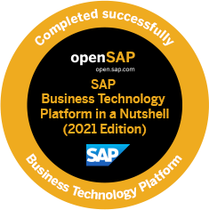

## Portfolio

* SAP Certified Development Specialist – ABAP on HANA 2.0
* Overall 5+ Years of experience in ERP as an Application Developer (SAP ABAP on HANA)
* Having experience of Three full life-cycle S/4 HANA greenfield implementation and one ECC implementation
  Projects.
* Solid development skills involving Interactive ALV Reports, BAdIs, User Exit, Customer Exit, BAPI and
  IDocs.
* Good working knowledge in ABAP RESTful Programming Model, CDS View, AMDP and Workflow.
* Well versed in the OOPs concepts and DDIC objects.

## Professional Experience

* #### Bosch
  - Working as a Senior SAP Technical Consultant

* #### EY Global Delivery Services India LLP, Bangalore, India
  - Worked as Gateway and OData Developer to create services to be consumed in Fiori applications.
  - Crated Adobe Form in SAP HCM module.
  - Created various fiori application using CDS Annotation and ABAP RESTful Programming Model.

* #### Accenture, Bangalore, India
  - Worked as a Senior Application Development Analyst
  - Interacted with Client and Onshore functional team, gathering requirement and providing solutions.
  - Implemented the proposed solution with high code quality and adherence to development standards.
  - Prepared proper and standard documentation (Technical Specification & Unit Test Plan) based on
    Functional specification/Business user's input.
  - Developed Stock adjustment Approval (Fiori App), implemented the service using ABAP RESTful
    Programming Model and approval part was implemented using Workflow.
  - Implemented PO and PR’s custom functionalities using BAdI and Customer Exit.
  - Worked on multiple standard and Custom IDocs.
  - Worked on CDS View & AMDP for Data Consumption.
  - Mentoring the Graduate Hires in the team to help them have a better understanding of the ways of
    working as well as help them get a head start on SAP ABAP.

* #### IBM India Pvt. Ltd., Kolkata, India
  - Worked as an Application Developer (SAP ABAP on HANA)
  - Developed the required functionality as per the Change Request based on the Development Strategy
    and Standards put down from the client end with at-most consideration on the performance impact.
  - Provided proper and standard documentations (Technical specification & Unit test plan) for objects
    produced.
  - Dedicated support during the Functional Unit Testing (FUT) and User Acceptance Testing (UAT)
    periods.
  - Development support during the Warranty period of the deliveries in Production.

## Skills
SAP ABAP, CDS View, AMDP, ABAP on HANA, Object Oriented Programming(ABAP OO), SAP Workflow, OData, RESTful Application Programming Model, SAP BTP.

## Education

* #### Rajiv Gandhi Proudyogiki Vishwavidyalaya, Bhopal, Madhya Pradesh

   *B.E. in Computer Science & Engineering (2012-2016)* 

## Certifications
 

    
    
 

